# PART 1 - LEARNING SHELL

``cd -`` => Change the working directory to previous working directory

``cd ~username`` => Change working directory to home directory of `username`

``ls ~ /usr`` => We can even specify multiple directories.

 ``ls -F`` => It will append a forward slash (/) if the name is a directory.

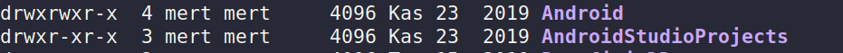

```
drwxrwxr-x
[directory] | Owner | Group | Everyone
```
```
4
File's number of hard links.
```

``file`` => shows detail of file.

For example;
``less /etc/password``

``G`` => Move to the end of the text file

``/<search text>`` => Pressing ``n`` forward the next occcurence of characters.

## You can copy text with mouse by click text doubly, then you paste with middle-click.

``cp -u *.html destination`` => Update copy when source is newer than destination.

## BE CAREFUL WITH RM.

``rm *.html`` is diffrent from ``rm * .html``

## Hard Links

It is not advisable. Space won't be allocated until all files deleted.

``ln -s item link``

`item` is either a file or a directory.

``type`` => Display a command's type.


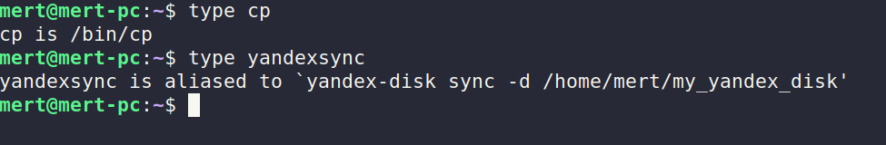

``which`` => Display an Executable's Location.

## which cannot show buildins or aliases.

``whatis ls`` => Display One-line Manual Page Descriptions.

``info `` => Alternative to `man`.

``alias foo='cd /usr; ls; cd -'`` => (no whitespace allowed for =)

``alias`` => You can list all aliases.

## Redirection

``ls -l > ls-output.txt`` => Redirect ls outputs to ls-output.txt.

`` >> `` => append text to existing file.

``> foo.txt`` => create a new file or truncate the output file.

## Redirection
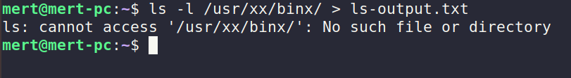

Above command redirects only std. output, not std. error. Error outputs are not redirected to ``ls-output.txt``

``ls -l /bin/x/y 2> ls-error.txt`` => Errors are redirect to ls-error.txt.

## Redirecting Standard Output and Standard Error to One File.

### ``ls -l /bin/usr > ls-all.txt 2>&1``

### Combine two redirection in recent version of bash, you can use following command

``ls -l /usr/bin &> ls-new.txt``

### Silence is golden :)

``ls -l /bin/ 2> /dev/null`` => Dispose unwanted output

Beneficial Commands
-   ``sort``
-   ``uniq`` => Omit repeated lines


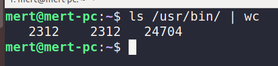

Line Count | Words Count | Bytes

### grep command

`` grep pattern`` 

-   ``-i`` => ignore case sensitivity
-   ``-v`` => print only lines that do not match pattern

### head/tail command

``head -n 5 ls-output.txt`` => Show only first 5 lines

``tail -n 5 ls-output.txt`` => Show only last 5 lines

### tail command instantly
``tail -f /var/log/messages`` => Monitor logs lively

### tee command
``ls /usr/bin | tee ls.txt | grep zip``

Read from stdin and output to stdout and files.

### Arithmetic expansion

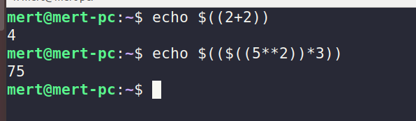

## Brace expansion

You can see all related examples following screenshot.

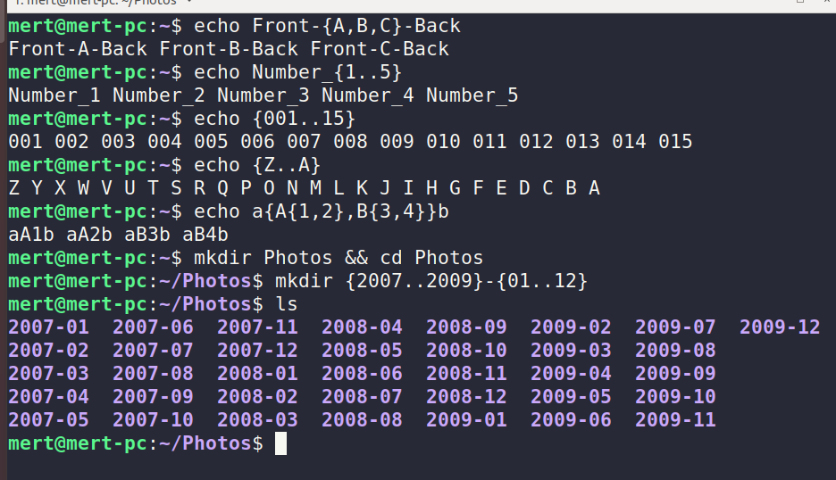

## Command Substituion

`` echo $(ls) ``

Command substitution allows us to use the output of a command as an expansion

There is an alternate syntax for command substitution. It uses backquotes instead of dollar sign an parantheses.

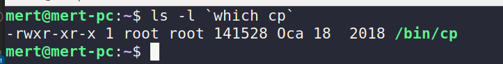

## Double Quotes

If we place text inside double quotes, all the special characters used by shell lose their special meanings. Exceptions are following:

-   #### $ (Dolar sign)
-   #### \ (Backslash)
-   #### ` (Backtick)

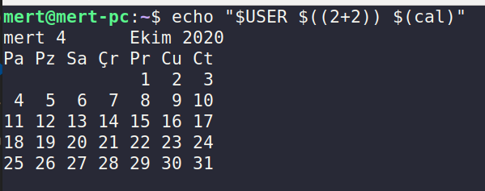

By default, word splitting looks for the presence of spaces, tabs ajd newlines. Treats them as `delimiters` between words.

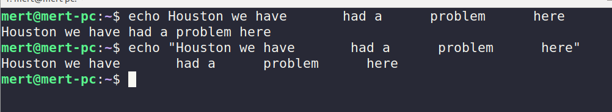

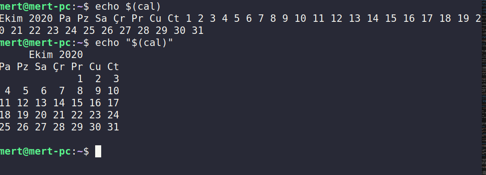

## To suppress all expansion, use single quotes(' ')

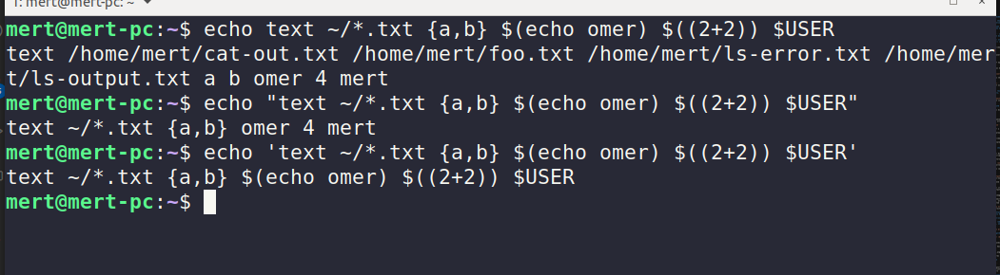

### Escaping character is \

``echo "\$9.99"``

### To use bell,

``echo -e "Time's up \a"``

## Advanced Keyboard Tricks
### Ctrl related commands
-   ``Ctrl + L`` is equivalent to ``clear``
-   ``Ctrl + A`` => Move to beginning of line
-   ``Ctrl + E`` => Move to end of line
-   ``Ctrl + K`` => Kill text from the cursor to the end of line.
-   ``Ctrl + U`` => Kill text from the cursor to the beginning of line.
-   
### Alt related commands
-   ``Alt + F`` => Move cursor forward one word
-   ``Alt + B`` => Move cursor back one word
-   ``Alt + U`` => Convert one word at cursor location to uppercase
-   ``Alt + L`` => Convert one word at cursor location to lowercase
-   ``Alt + D`` => Kill text from the cursor location to end of the current word.
-   ``Alt + Backspace`` => Kill text from cursor location to beginning of the current word.

``!88`` => You can use related history number command

``!!`` => Repeat last command.

## Permissions

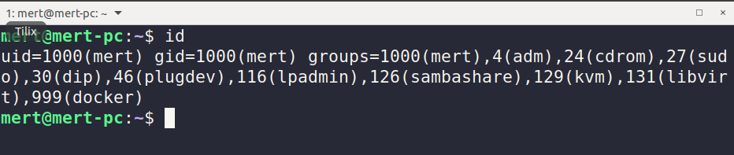

Like so many things in Linux, it comes from a couple of text file. 
-   User accounts are defined in the ``/etc/passwd``
-   Group are defined in the ``/etc/group``
-   These files are modified along with ``/etc/shadow``

### Detail of ``/etc/passwd``

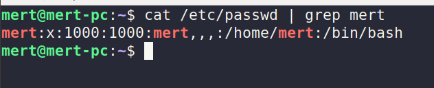

-   mert => means username
-   x => means existing encrypted password (encrypted passsword is stored in ``/etc/shadow``)
-   1000 => User id
-   1000 => Group id
-   mert,,, => User id info such as full name, phone number etc. 
-   /home/mert => home directory
-   /bin/bash => The absolute path of a command or shell. If shell set to /sbin/nologin and the user tries to log in to the Linux system directly, the /sbin/nologin shell closes the connection. They'll get a polite message saying 'This account is currently not available.' This message can be changed with the file /etc/nologin.txt.

### Detail of ``/etc/shadow``

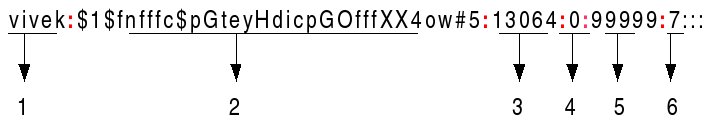

-   1. Username
-   2. Password:
    -   \$1\$ is MD5
    -   \$6\$ is SHA-512
-   3. Last password change (lastchanged)
-   4. Minimum
-   5. Maximum
-   6. Warn
-   7. Inactive
-   8. Expire

### Detail of ``/etc/group``

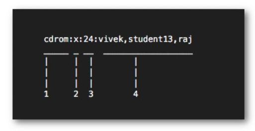

1.  group_name
2.  Password
3.  Group ID
4.  Group List

## chmod

``777`` => owner | group | other

Octal = 0, Binary = 000, File Mode = ---
Octal = 1, Binary = 001, File Mode = --x
Octal = 2, Binary = 010, File Mode = -w-
...
Octal = 7, Binary = 111, File Mode = rwx

-   ### u => Short for user
-   ### g => Group owner
-   ### o => Short for others
-   ### a => Short for all

#### u+x => Add execute permission for the owner
#### go=rw => See following screenshot
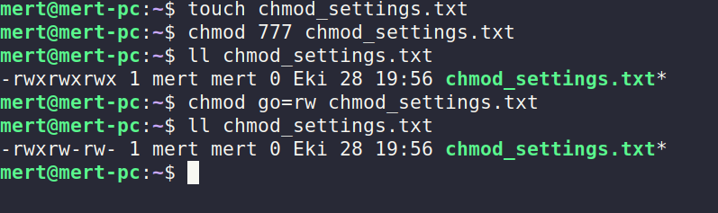
#### u-x => Remove execute settings from user
#### +x => equivalent to a+x

``umask`` => Set default permissions

### ``setuid`` and ``setgid``

When the setuid or setgid attributes are set on an executable file, then any users able to execute the file will automatically execute the file with the privileges of the file's owner (commonly root) and/or the file's group, depending upon the flags set. It will set its permissions to that of the user who created it (owner), instead of setting it to the user who launched it.

### sticky bit

This is often used to control access to a shared directory such as ``/tmp``.

If applied to a directory, it prevents users from deleting or renaming files unless the user is either the owner of directory, the owner of file the or the superuser.

``chmod u+s program``

``chmod g+s dir``

``chmod +t dir``


## ``chown``: Change file owner and group

``chown [owner][:[group]] file``

-   bob => Change only the ownership of file 
-   bob:users => Change owner and group
-   :admins => Change the group owner, the file owner is unchanged
-   bob: Changes the file owner from the current owner to user bob and changes the group owner to login group of user bob

## Process


``ps`` => It just shows processes associated with the current terminal

### To put a process in background

``xlogo &``

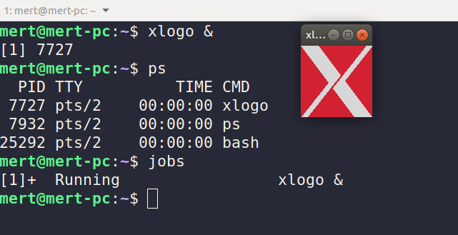

``jobs`` => It shows application from started by terminal


### Returning a Process to the Foreground

``fg %1``

### To stop process

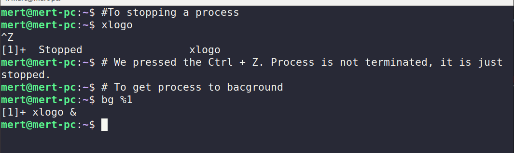

If window is changed, signal will be sent to system.

