# (PART 1) - LEARNING SHELL

``cd -`` => Change the working directory to previous working directory

``cd ~username`` => Change working directory to home directory of `username`

``ls ~ /usr`` => We can even specify multiple directories.

 ``ls -F`` => It will append a forward slash (/) if the name is a directory.


```
drwxrwxr-x
[directory] | Owner | Group | Everyone
```
```
4
File's number of hard links.
```

``file`` => shows detail of file.

For example;
``less /etc/password``

``G`` => Move to the end of the text file

``/<search text>`` => Pressing ``n`` forward the next occcurence of characters.

## You can copy text with mouse by click text doubly, then you paste with middle-click.

``cp -u *.html destination`` => Update copy when source is newer than destination.

## BE CAREFUL WITH RM.

``rm *.html`` is diffrent from ``rm * .html``

## Hard Links

It is not advisable. Space won't be allocated until all files deleted.

``ln -s item link``

`item` is either a file or a directory.

``type`` => Display a command's type.


``which`` => Display an Executable's Location.

## which cannot show buildins or aliases.

``whatis ls`` => Display One-line Manual Page Descriptions.

``info `` => Alternative to `man`.

``alias foo='cd /usr; ls; cd -'`` => (no whitespace allowed for =)

``alias`` => You can list all aliases.

## Redirection

``ls -l > ls-output.txt`` => Redirect ls outputs to ls-output.txt.

`` >> `` => append text to existing file.

``> foo.txt`` => create a new file or truncate the output file.

## Redirection


Above command redirects only std. output, not std. error. Error outputs are not redirected to ``ls-output.txt``

``ls -l /bin/x/y 2> ls-error.txt`` => Errors are redirect to ls-error.txt.

## Redirecting Standard Output and Standard Error to One File.

### ``ls -l /bin/usr > ls-all.txt 2>&1``

### Combine two redirection in recent version of bash, you can use following command

``ls -l /usr/bin &> ls-new.txt``

### Silence is golden :)

``ls -l /bin/ 2> /dev/null`` => Dispose unwanted output

Beneficial Commands
-   ``sort``
-   ``uniq`` => Omit repeated lines


Line Count | Words Count | Bytes

### grep command

`` grep pattern`` 

-   ``-i`` => ignore case sensitivity
-   ``-v`` => print only lines that do not match pattern

### head/tail command

``head -n 5 ls-output.txt`` => Show only first 5 lines

``tail -n 5 ls-output.txt`` => Show only last 5 lines

### tail command instantly
``tail -f /var/log/messages`` => Monitor logs lively

### tee command
``ls /usr/bin | tee ls.txt | grep zip``

Read from stdin and output to stdout and files.

### Arithmetic expansion


## Brace expansion

You can see all related examples following screenshot.


## Command Substituion

`` echo $(ls) ``

Command substitution allows us to use the output of a command as an expansion

There is an alternate syntax for command substitution. It uses backquotes instead of dollar sign an parantheses.


## Double Quotes

If we place text inside double quotes, all the special characters used by shell lose their special meanings. Exceptions are following:

-   #### $ (Dolar sign)
-   #### \ (Backslash)
-   #### ` (Backtick)


By default, word splitting looks for the presence of spaces, tabs ajd newlines. Treats them as `delimiters` between words.


## To suppress all expansion, use single quotes(' ')


### Escaping character is \

``echo "\$9.99"``

### To use bell,

``echo -e "Time's up \a"``

## Advanced Keyboard Tricks
### Ctrl related commands
-   ``Ctrl + L`` is equivalent to ``clear``
-   ``Ctrl + A`` => Move to beginning of line
-   ``Ctrl + E`` => Move to end of line
-   ``Ctrl + K`` => Kill text from the cursor to the end of line.
-   ``Ctrl + U`` => Kill text from the cursor to the beginning of line.
-   
### Alt related commands
-   ``Alt + F`` => Move cursor forward one word
-   ``Alt + B`` => Move cursor back one word
-   ``Alt + U`` => Convert one word at cursor location to uppercase
-   ``Alt + L`` => Convert one word at cursor location to lowercase
-   ``Alt + D`` => Kill text from the cursor location to end of the current word.
-   ``Alt + Backspace`` => Kill text from cursor location to beginning of the current word.

``!88`` => You can use related history number command

``!!`` => Repeat last command.

## Permissions


Like so many things in Linux, it comes from a couple of text file. 
-   User accounts are defined in the ``/etc/passwd``
-   Group are defined in the ``/etc/group``
-   These files are modified along with ``/etc/shadow``

### Detail of ``/etc/passwd``


-   mert => means username
-   x => means existing encrypted password (encrypted passsword is stored in ``/etc/shadow``)
-   1000 => User id
-   1000 => Group id
-   mert,,, => User id info such as full name, phone number etc. 
-   /home/mert => home directory
-   /bin/bash => The absolute path of a command or shell. If shell set to /sbin/nologin and the user tries to log in to the Linux system directly, the /sbin/nologin shell closes the connection. They'll get a polite message saying 'This account is currently not available.' This message can be changed with the file /etc/nologin.txt.

### Detail of ``/etc/shadow``


-   1. Username
-   2. Password:
    -   \$1\$ is MD5
    -   \$6\$ is SHA-512
-   3. Last password change (lastchanged)
-   4. Minimum
-   5. Maximum
-   6. Warn
-   7. Inactive
-   8. Expire

### Detail of ``/etc/group``


1.  group_name
2.  Password
3.  Group ID
4.  Group List

## chmod

``777`` => owner | group | other

Octal = 0, Binary = 000, File Mode = ---
Octal = 1, Binary = 001, File Mode = --x
Octal = 2, Binary = 010, File Mode = -w-
...
Octal = 7, Binary = 111, File Mode = rwx

-   ### u => Short for user
-   ### g => Group owner
-   ### o => Short for others
-   ### a => Short for all

#### u+x => Add execute permission for the owner
#### go=rw => See following screenshot

#### u-x => Remove execute settings from user
#### +x => equivalent to a+x

``umask`` => Set default permissions

### ``setuid`` and ``setgid``

When the setuid or setgid attributes are set on an executable file, then any users able to execute the file will automatically execute the file with the privileges of the file's owner (commonly root) and/or the file's group, depending upon the flags set. It will set its permissions to that of the user who created it (owner), instead of setting it to the user who launched it.

### sticky bit

This is often used to control access to a shared directory such as ``/tmp``.

If applied to a directory, it prevents users from deleting or renaming files unless the user is either the owner of directory, the owner of file the or the superuser.

``chmod u+s program``

``chmod g+s dir``

``chmod +t dir``


## ``chown``: Change file owner and group

``chown [owner][:[group]] file``

-   bob => Change only the ownership of file 
-   bob:users => Change owner and group
-   :admins => Change the group owner, the file owner is unchanged
-   bob: Changes the file owner from the current owner to user bob and changes the group owner to login group of user bob

## Process


``ps`` => It just shows processes associated with the current terminal

### To put a process in background

``xlogo &``


``jobs`` => It shows application from started by terminal


### Returning a Process to the Foreground

``fg %1``

### To stop process


If window is changed, signal will be sent to system.

# (PART - 2) Configuration and The environment

## The environment

### Examining the environment

``printenv`` => Display envrionment variables.

### How is the Environment Established?

#### A login shell session:
This is one in which we are prompted for our username and password. This happens when we start a virtual console session.

##### Startup Files for a login shell sesion
-   /etc/profile
-   ~/.bash_profile
-   ~/.bash_login
-   ~/.profile

#### A non-login shell session

This typically occurs when we launch a terminal session in GUI.

##### Startup files for non-login shell sessions
-   /etc/bash.bashrc
-   ~/.bashrc

## A Gentle Introduction

### If you get lost in vim, you can press ESC twice. 

You can delete line by pressing ``dd``.

You can search text with ``/`` like ``less``

You can open multiple files with ``vim``.

You can paste by pressing ``p``.

## Customizing Prompt

You can customize prompt. 

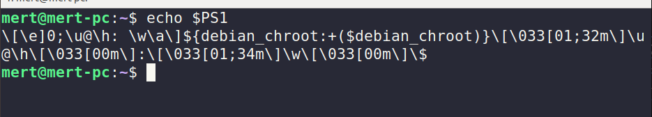


# (PART-3) COMMON TASK AND ESSENTIAL TOOLS

## Package Management

### Finding a Package in a Repository

``apt-cache search <package_name>``

### Listing installed packages

``dpkg -l``

## Storage Media

Working directory should be changed to apply ``unmount`` succesfully.

Output of ``/etc/fstab``

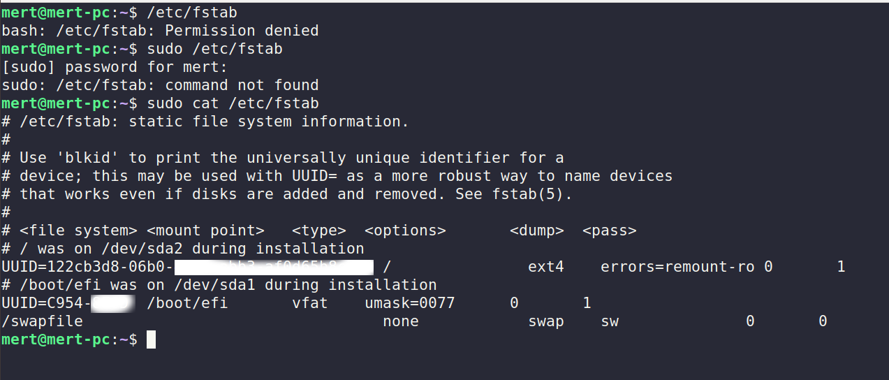

``/dev/sda2 on / type ext4 (rw,relatime,errors=remount-ro)``
=> Root file is mounted to ``/dev/sda2``

``mount -t iso9660 /dev/sdc /mnt/cdrom``

``fdisk`` can be used to manipulate partitions.

``mkfs`` can be used to create a new file system.

``fsck`` can be used to test and repair file system.

### Moving Data Directly to and from Devices

``dd if=/dev/sdb of=/dev/sdc``

Alternately, if only the first device were attached to the computer, we could copy its contents to an ordinary file for later restoration or copying.

``dd if=/dev/sdb of=flash_drive.img``

#### After inserting the CD and determining its device name (we'll assume /dev/cdrom), we can make ISO file like so

``dd if=/dev/cdrom of=ubuntu.iso``

#### For audio CDs, look at the ``cdrdao`` command.

#### To create an ISO image file containing the contents of a directory, we use the ``genisoimage`` program.

``genisoimage -o cd-rom.iso -R -J ~/cd-rom-files``

### Mounting an ISO Image Directly

``mkdir /mnt/iso_image``

``mount -t iso9660 -o loop image.iso /mnt/iso_image``

### Blanking a Rewritable CD-ROM

``wodim dev=/dev/cdrom blank=fast``

### Writing an Image

``wodim dev=/dev/cdrw image.iso``

## Networking

``netstat -ie`` => Shows interfaces.

## Searching for files

### locate - Find files the easy way
``locate bin/zip`` => It can find a file based solely on its name.

### find - The find program searches a given directory ( and its subdirectories) for files based on a variety attributes.

To find all directories.

``find ~ -type d | wc -l``

To find regular file 
``find ~ -type f -name "*.JPG" -size +1M | wc -l``

Note: -iname => Searching for case-insensitive.

``find ~ \(-type f -not -perm 600) or (-type d -not -perm 700) ``

``find ~ -type f -name '*.bak' -delete`` => Delete files ending with bak.

#### Always test the command first by substituting the -print action for -delete to confirm the search results.

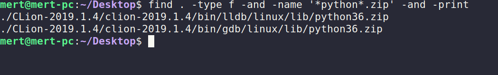

### Use ``exec`` command

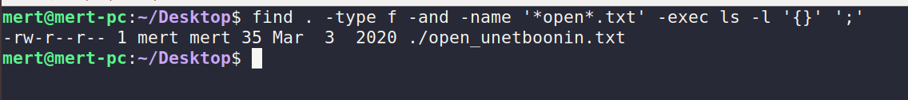

Note:
``'{}' ';'`` => means current pathname

### To get confirmation before action is performed.

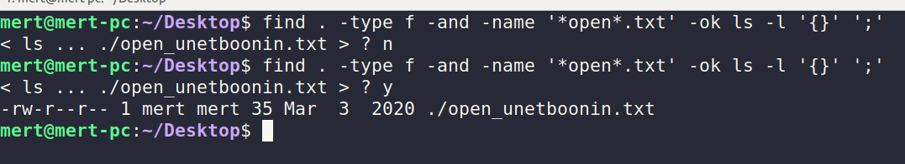

### touch command actually updates the file.

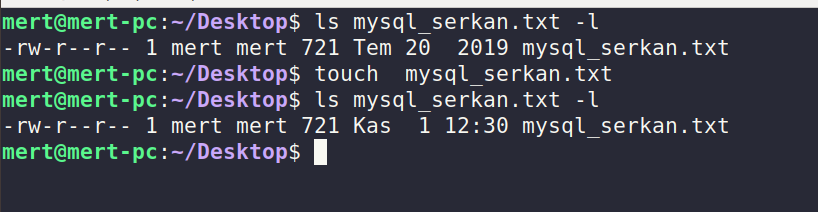

## Archiving and backups

#### JPEG and MP3 are lossy compressions.

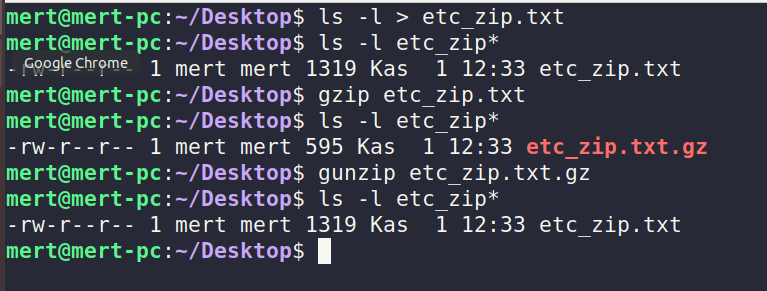

#### To view files of gzip

``gunzip -tv etc_zip.txt.gz``

``bzip2`` is similart to gzip but uses a different compression algorithm.

### Don't do this
``gzip picture.jpg``

Because file jpg is already compressioned, you shouldn't compress it though.

### ``command tar``

Stand for tape archive.

#### To create tar file
``tar cf playground.tar playground``

c => means create
f => means file

#### To test file tar
``tar tvf playground.tar``

#### To extract tar file

``tar xf tarfilename.tar``

#### Tar wih gzip

``tar czf playground.tgz``

Note: z => means gzip
Note: j => means bz2

#### rsync doesn't support remote-remote synchorinization. 

## Regular expressions

To use any character in regular expression, ``.(dot)`` is used.

^ => Find at beginning.

$ => Find at ending.

#### To use bracket expansions and character classes

``grep -h '[bg]zip' dirlist*.txt``

-h => suppress output file name

#### Negation
``grep -h '[^bg]zip' dirlist*.txt``

``grep -h '^[A-Z]' dirlist.txt``

## Text Processing

### sort command

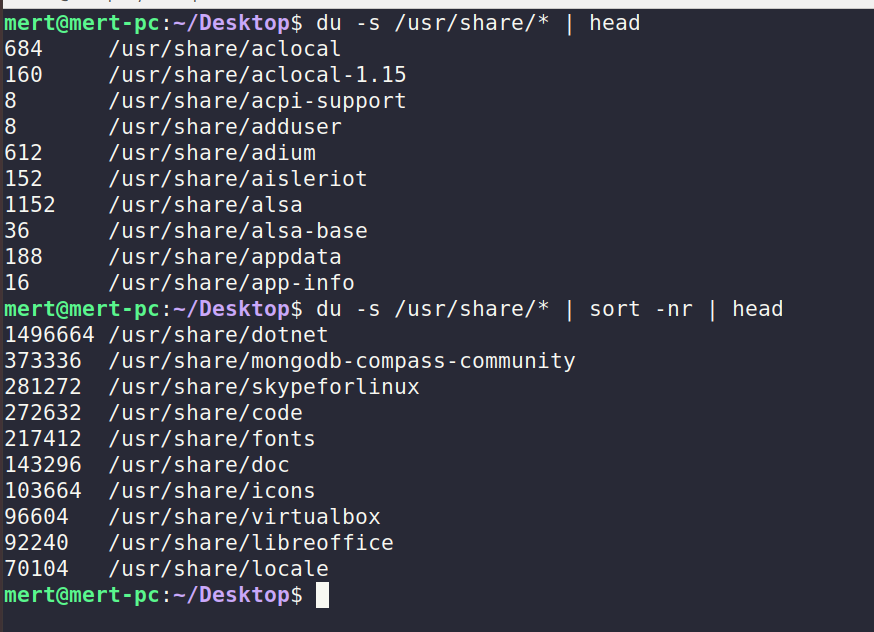

sort -n => sort inputs numerically

sort -r => sort reversely

### sort input based on definite column

(It starts with column 1)

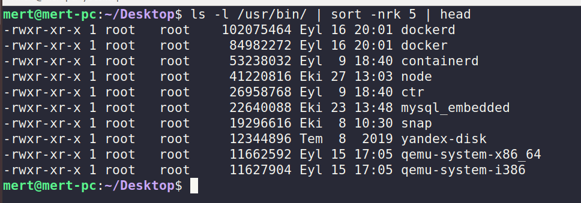

``sort --key=1,1 --key=2n distros.txt``

|         |       |           |
|---------|-------|-----------|
| Fedora  |5      |03/20/2006 |
| Fedora  |6      |10/24/2006 |
| Suse    |10.1   |05/11/2206 |
| Ubuntu  |6.06   |06/01/2006 |
| Ubuntu  |7.10   |10/18/2007 |
| Ubuntu  |8.10   |10/30/2008 |

``--key=1,1`` => means start at field 1 and end at field 1.

``--key=2n`` => means field 2 is sort key and that the sort should be numeric.

``sort -k 3.7nbr -k 3.1 nbr -k 3.4nbr distros.txt``

``-k 3.7nbr`` => means that use a sort key that begins at the seventh character within third field, n means numeric, b means that suppress the leading spaces. r means reverse.

#### Sort with delimiter
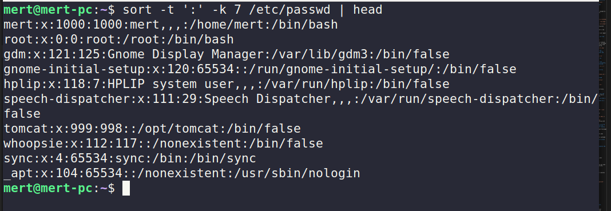

### Slicing and Dicing


#### Cutting character

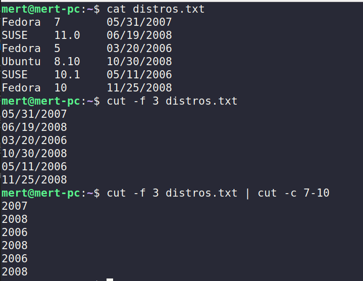

### Cut based on delimiter

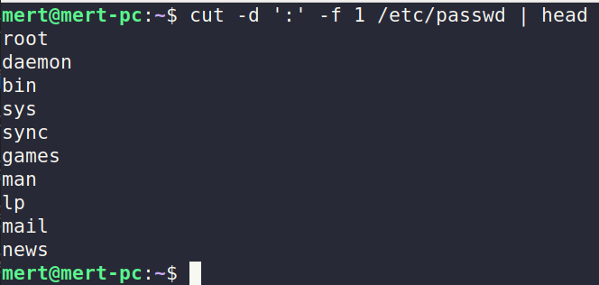

``expand`` => convert tabs to spaces

### Paste merge lines of files

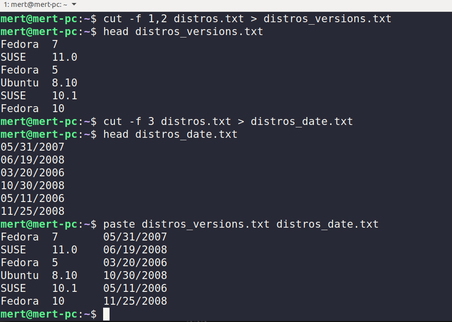

### Compare Files Line By Line

There are two popular format at diff.

1. Context format ``diff -c file1.txt file2.txt``

2. Unified format ``diff -u file1.txt file2.txt``

### Prepare patch format

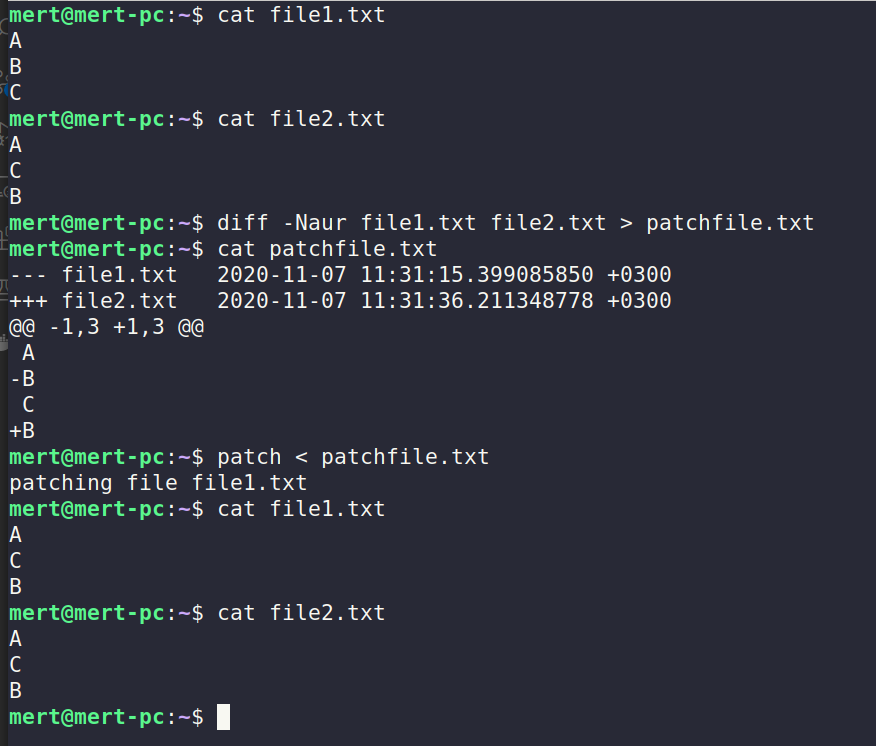

### Editing on the fly

#### Transliterate or Delete Characters
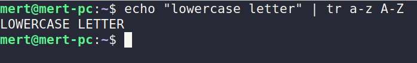

### ROT13 Encryption
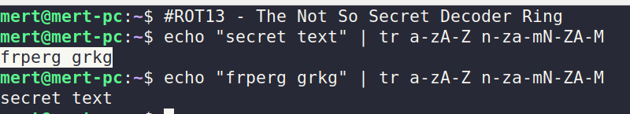

### sed - Stream editor for filtering and transforming text

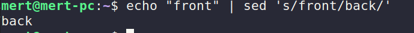

#### To specify line number

``sed '2s/front/back/`` => sed search on line 2. If number isnot specified, every line will be searched/replaced.

## Formatting Output

``nl`` equals to ``cat -n``. They show line numbers.

#### fold

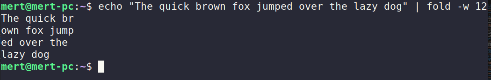

You can use printf like C in bash.

#### Document Format Systems

``groff``

#### zcat
```
Normally, files compressed using gzip can be restored to their original form using gzip -d or gunzip commands. What if you want to view the contents of a compressed file without uncompressing it? For this purpose, you need the zcat command utility.
```

#### To create pdf from ps format

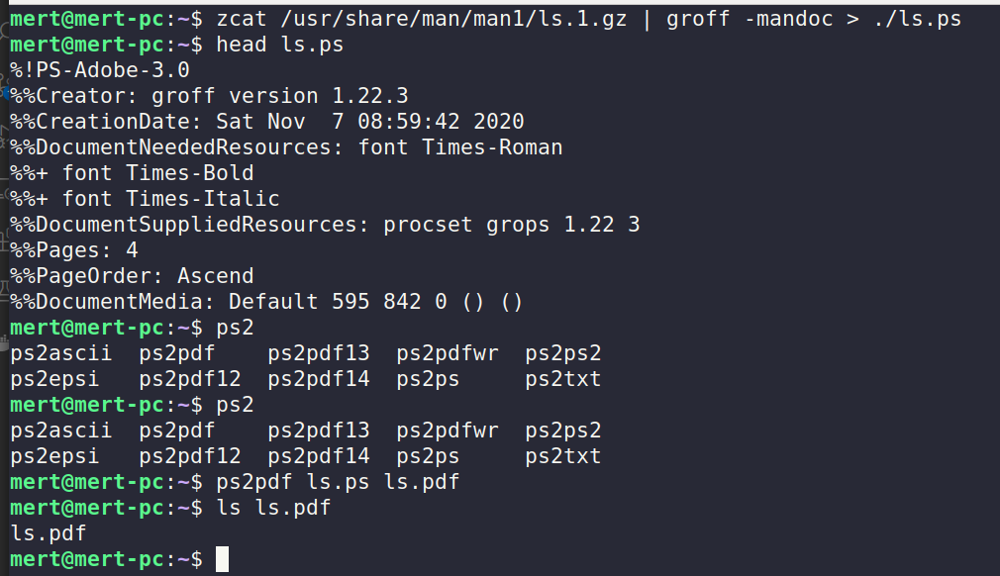

## Printing

### pr - Convert text files for printing

Print text files with 3 column and width 65

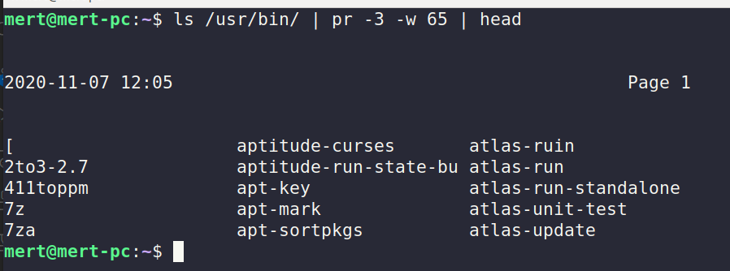

#### lpr => send files to default printer

#### ``lpr -P printer_name``

``-t`` => omit headers
``-3`` => 3 columns

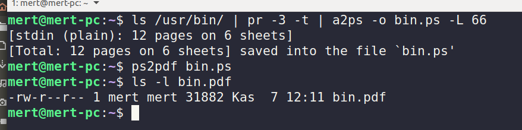

``lpstat`` => Display print system status.

``lpq`` => Display printer queue status

``lprm/cancel`` => Cancel print jobs

# (PART 4) Writing Shell Scripts

#### Assign value to variable & Use Variables

```
TITLE="System Information Report"

echo "
<html>
    <title>$TITLE</title>
</html>
";
```

``CURRENT_TIME="$(date)"``

### Here Documents

```
TITLE="System Information Report for $HOSTNAME"
CURRENT_TIME="$(date + "%x %r %Z)"

cat << _EOF_
<html>
    <head>
        <title>$TITLE</title>
    </head>
    <body>
        <h1>$TITLE</h1>
        <p>$TIMESTAMP</p>
    </body>
</html>

_EOF_

```

``<<- `` => ignore leading tabs

### Here Document example

```
#!/bin/bash

FTP_SERVER=ftp.nl.debian.org
FTP_PATH=/debian/dists/stretch/main/installer-amd64/current/images/cdrom
REMOTE_FILE=debian-cd_info.tar.gz

ftp -n << _EOF_

open $FTP_SERVER
user anonymous me@linuxbox
cd $FTP_PATH
hash

_EOF_


```

### if statements

#### Equality for if statements

```
if [ "$x" -eq 5 ]; then
    echo "x equals 5."
else
    echo "x does not equals 5."
fi
```

### Exit status

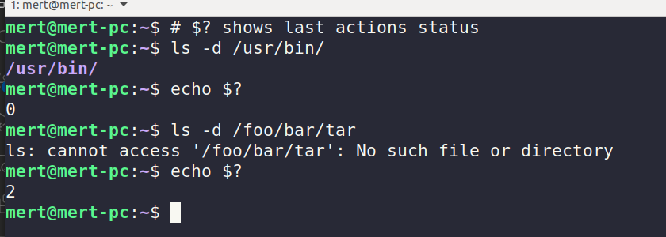

### Using test

-   -e  => file exists?
-   -f  => regular file?
-   -d  => directory?

```
    if [-f "$FILE"]; then
        echo "file"
    fi
```

``-z`` => length of string is zero?

``-eq`` => integer1 is equal to integer 2

```
    if [ "$INT" -eq 0]; then
        echo "zero"
    fi
```

### A More Modern Version of test

```
[[ expression ]]

string1 =~ regex

Example:

if [[ "$INT" =~ ^-?[0-9]+$ ]]; then
    echo "INT is zero"
fi
```

### ((  )) - Designed for Integers

```
    # Not use $
    if (( INT == 0 )); then

    fi

```

### Combining expressions
|Operation | test | [[ ]] and (( ))|
|----------|------|----------------|
|AND       | -a   | &&             |
|OR        | -o   | \|\|           |
|NOT       | !    | !              |

## Strings and Numbers

### IFS (Internal Field Seperator)

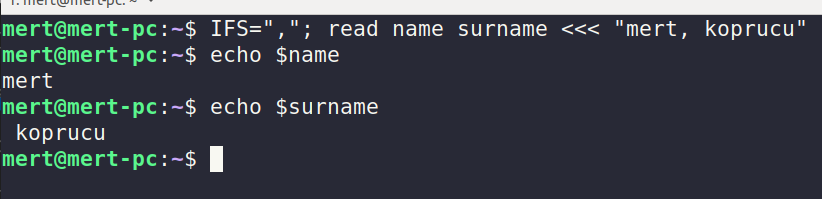

#### To trace bash comman, -x parameter can be used.

``#!/bin/bash -x``

`` ${foo:-"If it is not set, value will be this text."} ``

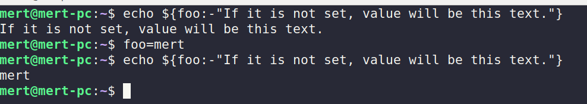

!!!!!!!!!!Sayfa 419'dan devam

### Error if empty

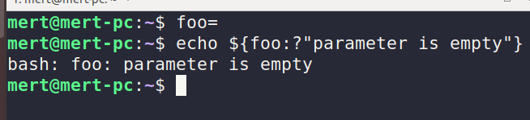

### Expansion That Return Variable NAmes

``${!prefix*}

### Length of String

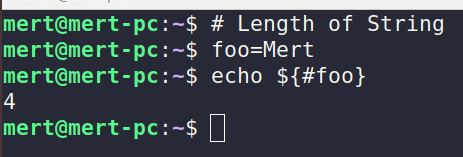

### Extract a portion of the string

```
${parameter:offset}
${parameter:offset:length}

```

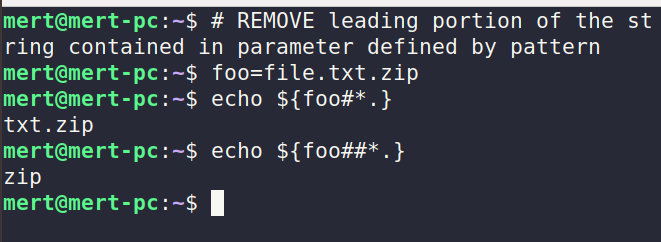


### To remove text from end of string.

```
${parameter%pattern}
${parameter%%pattern}
```

### Find and replace

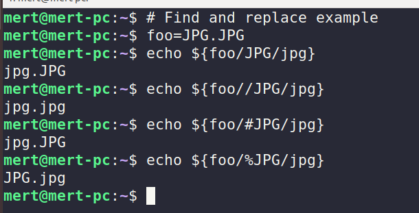

## EXOTICA

#### Group Command

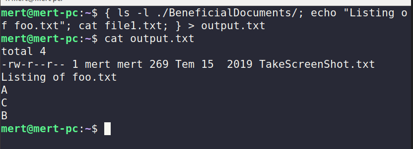


### Process substitiun

If pipeline exists, then subshell will be applied. Therefore, environment variables in subshell get lost after subshell processing is ended up. To solve problem, we can employ process substitution like this.


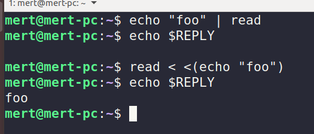

### Traps

We can use to handle received signals for script and we can ignore this signal.

To use this, we can ``traps``

### Temporary files

It is important to give temporary files nonpredictable file names. This avoids an exploit known as a ``temp race attack``

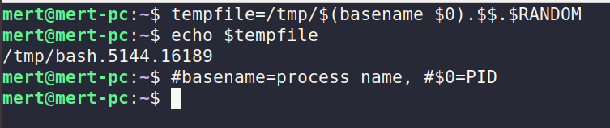

### Asynchronous Execution with wait

#### Parent

```
#!/bin/bash
echo "Parent: starting..."
./async-child.sh &
pid=$! # Give last job id
echo "Parent: child (PID=$pid) launched"
echo "Parent continuing"
sleep 2
echo "Parent: pausing to wait for child to finish...."
wait $pid
echo "Parent: child is finished. Continuing"
echo "Parent: parent is done. Exiting"
```

#### Child

```
#!/bin/bash
echo "Child: child is running..."
sleep 5
echo "Child: chils is done. Exiting."
```

### Codes

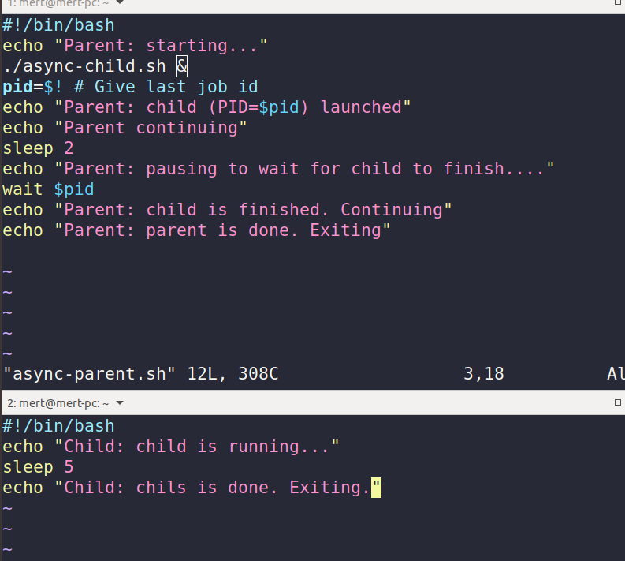

### Result

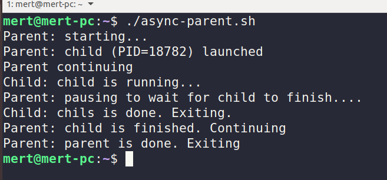

### Named Pipes

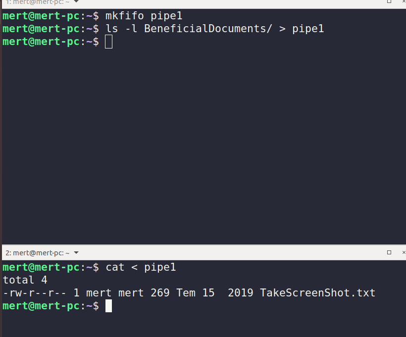

To create pipe, ``mkfifo`` is used.

After ``ls -l sth``, ``ls`` command wait to meet another process. In this example, responding process is ``cat``.


